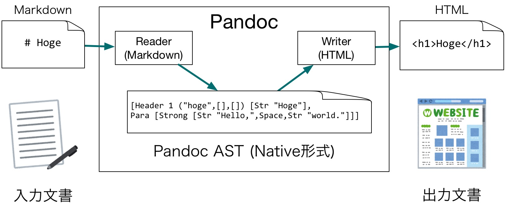

------------------------------------------------------------------------

自己紹介
========

-   名前
    -   藤原 惟
    -   すかいゆき ([@sky\_y](https://twitter.com/sky_y))
    -   Yuki Fujiwara （本名）
-   職業
    -   フリープログラマ
    -   専門学校 非常勤講師

------------------------------------------------------------------------

Pandocに関する活動
==================

-   Qiitaを中心に記事執筆
    -   [多様なフォーマットに対応！ドキュメント変換ツールPandocを知ろう - Qiita](http://qiita.com/sky_y/items/80bcd0f353ef5b8980ee)
-   Pandocユーザーズガイドを和訳
    -   [Pandoc ユーザーズガイド 日本語版](http://sky-y.github.io/site-pandoc-jp/users-guide/)
    -   バージョンが古くなったので、改訂を予定

------------------------------------------------------------------------

発表を始めます
==============

------------------------------------------------------------------------

このチュートリアルでやること（2回分の概要）
===========================================

-   第1回（今回） Pandocでドキュメントを変換しよう
    -   Pandocをツールとして使う（入門編、第2回の基礎知識）
-   **第2回 HaskellでPandocを拡張してみよう** （←いまここ）
    -   Haskellのやさしい入門（を目指します）
    -   「日常的な実用言語」としてのHaskellを体験してもらいたい
    -   Pandocのソースコードも少し読みます

------------------------------------------------------------------------

Pandoc公式サイト
================

-   [Pandoc - About pandoc](http://pandoc.org/index.html)
-   ユーザーズガイド
    -   [Pandoc - Pandoc User’s Guide](http://pandoc.org/MANUAL.html)
    -   [Pandoc ユーザーズガイド 日本語版](http://sky-y.github.io/site-pandoc-jp/users-guide/)

------------------------------------------------------------------------

Pandocとは（第1回の短いおさらい）
=================================

------------------------------------------------------------------------

Pandocとは
==========

-   [Pandoc - About pandoc](http://pandoc.org/index.html)
-   文書変換ツール
    -   あるフォーマットで書かれた文書を、別のフォーマットに変換するツール
-   Pandocの特徴は、対応フォーマットが非常に多いこと

------------------------------------------------------------------------


------------------------------------------------------------------------

[](http://pandoc.org/diagram.jpg)

------------------------------------------------------------------------

Pandoc実装の概要
================

-   言語: Haskell
    -   Pandoc的には、「厳密に型が定義されている」ことがありがたい
    -   Haskellは構文解析器(パーサ)を作るのにすごく適している (Parsecなど)
-   モジュール構成
    -   Reader: 入力文書を解析し、Haskell上の中間文書に変換する
    -   Writer: 中間文書を受け取り、出力フォーマットに変換する

------------------------------------------------------------------------



------------------------------------------------------------------------

Pandocをインストールする
========================

-   ターミナル(Mac/Linux)またはコマンドプロンプト(Windows)
-   パッケージを直接落としてインストール
    -   [Pandoc ダウンロードページ](https://github.com/jgm/pandoc/releases/latest)
        -   Windows: `.msi`, Mac: `.pkg`
-   パッケージマネージャでインストール
    -   Mac([Homebrew](http://brew.sh/index_ja.html)): `$ brew install pandoc`
    -   Windows([Chocolatey](https://chocolatey.org/)): `> cinst pandoc`
    -   Linux(Debian): `$ sudo apt-get install pandoc`

------------------------------------------------------------------------

wkhtmltopdfのインストール
=========================

-   PDF出力のために必要（おすすめ）
-   パッケージを直接落としてインストール
    1.  [ここからパッケージをダウンロード](http://wkhtmltopdf.org/downloads.html)
        -   Windowsは未検証ですが、MinGWの方を試してみてください
    2.  インストール
-   パッケージマネージャでインストール
    -   Mac: `$ brew cask install wkhtmltopdf`
        -   Caskの方なので注意

------------------------------------------------------------------------

Pandocで遊ぶ
============

    $ pandoc --version
    $ echo "**Hello**" | pandoc -f markdown -t html
    <p><strong>Hello</strong></p>
    $ echo "**Hello**" | pandoc -f markdown -t html5 -o hello.pdf
    （PDFが生成される）

------------------------------------------------------------------------

PandocのFilterとは
==================

------------------------------------------------------------------------

PandocのFilterとは
==================

-   ReaderとWriterの間で処理を行う外部プログラム
    -   Unix/コマンドプロンプトのパイプを使って書ける
    -   JSON形式の文書(JSON AST)でやり取りする
        -   Haskell以外の言語でも実装可能

------------------------------------------------------------------------


------------------------------------------------------------------------

Filter: コマンドでいえば
========================

    pandoc --filter ./hoge.py -t latex

と

    pandoc -t json | ./hoge.py latex | pandoc -f json -t latex

は等価

------------------------------------------------------------------------

Filterを動かしてみよう
======================

-   [公式サンプル](https://github.com/jgm/pandocfilters/tree/master/examples)から「[caps.py](https://github.com/jgm/pandocfilters/blob/master/examples/caps.py)」を動かしてみる。
    -   Pythonのpipを使用。環境がない人はデモだけ見て下さい

<!-- -->

    $ sudo pip install pandocfilters
    $ curl -O https://raw.githubusercontent.com/jgm/pandocfilters/master/examples/caps.py
    $ echo 'abc' | pandoc --filter ./caps.py -t html
    <p>ABC</p>

------------------------------------------------------------------------

caps.py の実装
==============

``` python
from pandocfilters import toJSONFilter, Str

def caps(key, value, format, meta):
    if key == 'Str':
        return Str(value.upper())

if __name__ == "__main__":
    toJSONFilter(caps)
```

------------------------------------------------------------------------

Filterを実装する手順
====================

-   PandocのJSON ASTを読み込めるライブラリを使う
    -   参考: [Pandoc Filters · jgm/pandoc Wiki](https://github.com/jgm/pandoc/wiki/Pandoc-Filters)
-   次の仕様を満たす関数を実装し、`toJSONFilter`の引数に与える
    -   引数を使い、変換前のJSON ASTを受け取る
    -   JSON ASTを変換（要素を追加・変更・削除）する
    -   変換後のJSON ASTを返す
-   補足: `toJSONFilter`が、標準入力・標準出力を通じたJSON ASTのやりとりを代理してくれる

------------------------------------------------------------------------

PandocのASTを知る
=================

------------------------------------------------------------------------

PandocのASTを知る
=================

-   厳密な仕様はここに載っています
    -   [Text.Pandoc.Definition](https://hackage.haskell.org/package/pandoc-types-1.17.0.5/docs/Text-Pandoc-Definition.html)
    -   今回は割愛します（自分で実装したい際に参照してください）

------------------------------------------------------------------------

ASTは、厳密には2種類ある
========================

-   JSON AST
    -   ただのJSONなので、どの言語でも利用できる
    -   冗長、読むのがしんどい
-   Pandoc Native形式
    -   Haskellのデータ型`Pandoc`として定義される
    -   パターンマッチングが使える（うれしい）
    -   簡潔で読みやすい

------------------------------------------------------------------------

ASTの比較
=========

HTML

``` html
<p><strong>test</strong></p>
```

JSON AST

``` json
{"blocks":[{"t":"Para","c":[{"t":"Strong","c":[{"t":"Str","c":"test"}]}]}],"pandoc-api-version":[1,17,0,4],"meta":{}}
```

Pandoc Native

``` haskell
[Para [Strong [Str "test"]]]
```

------------------------------------------------------------------------

これからやりたいこと
====================

``` haskell
[Para [Strong [Str "test"]]]
```

-   このようなASTを変換するような関数を、Haskellで書きたい

------------------------------------------------------------------------

Haskellの概要
=============

------------------------------------------------------------------------

StackでHaskellのHelloWorldを書こう
==================================

------------------------------------------------------------------------

Pandoc FilterをHaskellで書こう
==============================

------------------------------------------------------------------------

質問・作業・もくもく会
======================

-   Slackにて受け付けます （`#field`）
-   TwitterでもOKです
    -   [@sky\_y | Twitter](https://twitter.com/sky_y)
